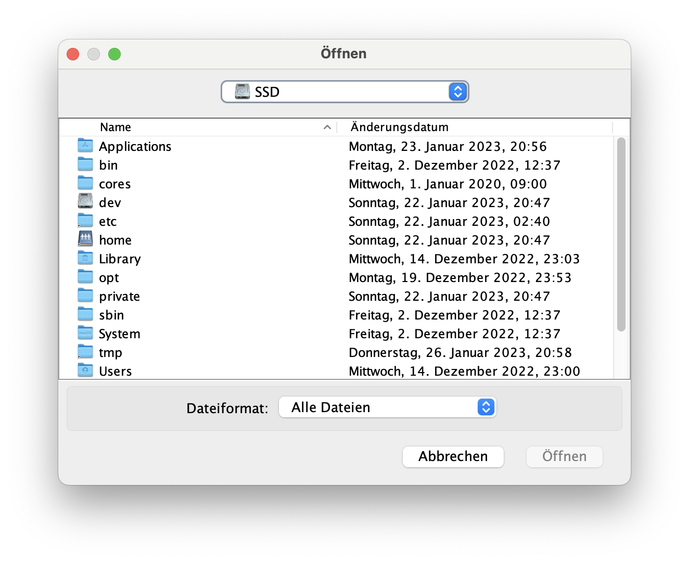
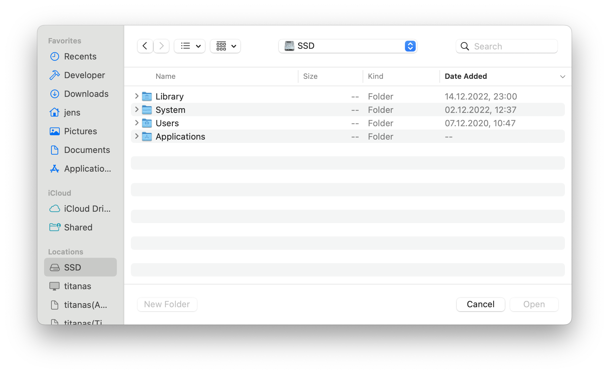
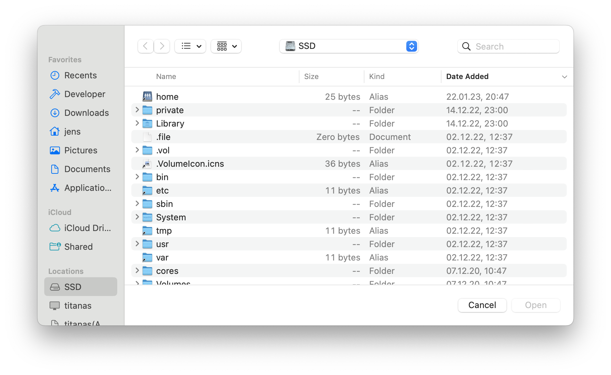

ifdef::env-github[]
:tip-caption: :bulb:
:note-caption: :information_source:
:important-caption: :heavy_exclamation_mark:
:caution-caption: :fire:
:warning-caption: :warning:
endif::[]

== filedialogs

Demonstration of Java file dialogs:

=== JFileChooser -- Swing

.`javax.swing.JFileChooser`

=== FileDialog -- AWT

.`java.awt.FileDialog`

=== FileChooser -- JavaFX

.`javafx.stage.FileChooser`
